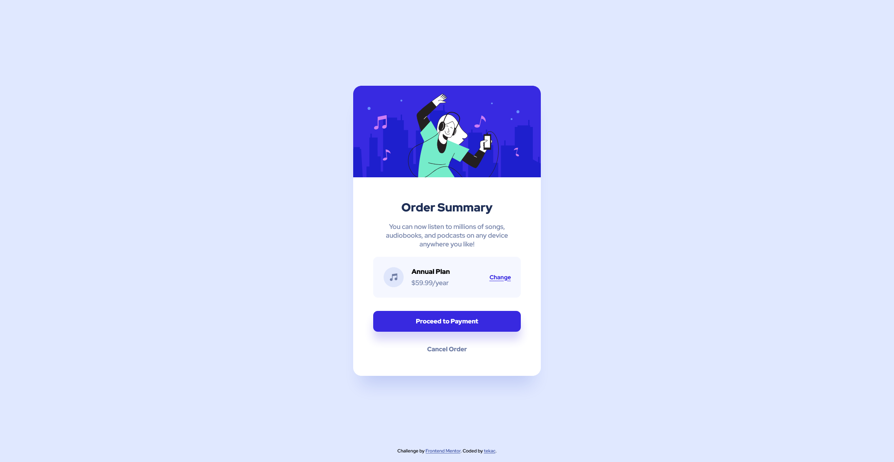

# Frontend Mentor - Order summary card solution

This is a solution to the [Order summary card challenge on Frontend Mentor](https://www.frontendmentor.io/challenges/order-summary-component-QlPmajDUj). Frontend Mentor challenges help you improve your coding skills by building realistic projects.

## Table of contents

- [Overview](#overview)
  - [The challenge](#the-challenge)
  - [Screenshot](#screenshot)
  - [Links](#links)
- [My process](#my-process)
  - [Built with](#built-with)
  - [What I learned](#what-i-learned)
  - [Continued development](#continued-development)
- [Author](#author)

## Overview

### The challenge

Users should be able to:

- See hover states for interactive elements

### Screenshot

### Links

- Solution URL: [Add solution URL here](https://github.com/tekac/frontendmentor.io/tree/main/order-summary-component-main)
- Live Site URL: [Add live site URL here](https://unruffled-nightingale-2f41cd.netlify.app/)

## My process

### Built with

- Semantic HTML5 markup
- CSS custom properties
- Flexbox

### What I learned

Havent studied in a month due to life situations however I wanted to jump right into a project to see if my skills were still solidifed from months of learning. I engaged this project and it was suprisingly very straightforward. This is a very basic project with no Javascript involved .. but I wanted to see how quickly I can write HTML/CSS with Flexbox and get it going.

### Continued development

Continuing learning I wan't to start some of the Junior level projects on FrontendMentor and get working with Javascript more. I need to learn API's and working with API's to get ready for a career change into the web development field.

## Author

- Website - [tekac](https://github.com/tekac)
- Frontend Mentor - [@tekac](https://www.frontendmentor.io/profile/tekac)
