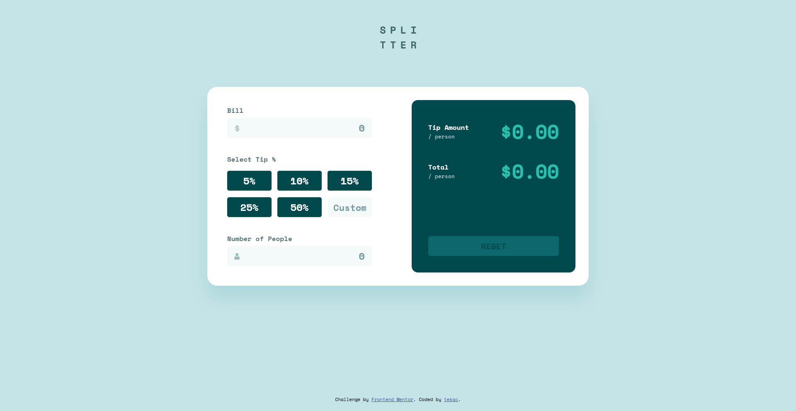

# Frontend Mentor - Tip calculator app solution

This is a solution to the [Tip calculator app challenge on Frontend Mentor](https://www.frontendmentor.io/challenges/tip-calculator-app-ugJNGbJUX). Frontend Mentor challenges help you improve your coding skills by building realistic projects.

## Table of contents

- [Overview](#overview)
  - [The challenge](#the-challenge)
  - [Screenshot](#screenshot)
  - [Links](#links)
- [My process](#my-process)
  - [Built with](#built-with)
  - [What I learned](#what-i-learned)
  - [Continued development](#continued-development)
  - [Useful resources](#useful-resources)
- [Author](#author)

## Overview

### The challenge

Users should be able to:

- View the optimal layout for the app depending on their device's screen size
- See hover states for all interactive elements on the page
- Calculate the correct tip and total cost of the bill per person

### Screenshot



### Links

- Solution URL: [Github](https://github.com/tekac/frontendmentor.io/tree/main/tip-calculator-app)
- Live Site URL: [Live-Preview](https://lucid-elion-1e2077.netlify.app/)

## My process

### Built with

- Semantic HTML5 markup
- SCSS
- Flexbox
- Vanilla JS

### What I learned

I learned a better process on organizing HTML and the SCSS. The Javascript was a little tricky at first as I had not practiced it in awhile because I was trying to get better at HTML/CSS. I pulled through and I believe I came up with a great solution. This overall was a great learning experience. I learned a ton with it all.

Amongst my favorites were learning about char validation to prevent people from entering letter's and causing problems in the calculator. I also practiced with SCSS nesting and utilizing :not for the buttons.

```css
&:not(:last-child) {
  margin-right: 1.4rem;
}
```

```js
function charValid(e) {
  if (e.keyCode >= 65 && e.keyCode <= 90) {
    e.preventDefault();
    return false;
  }
}
```

### Continued development

I'm going to do more refactoring with this project to finalize its code organization. I've already done some refactoring and its been a good experience. I'd like to try mobile-first development with some future projects.

### Useful resources

- [Stack Overflow](https://stackoverflow.com/) - Stack Overflow is just an immense resource. Usually will have answers for any questions you have about a topic, even if you don't exactly know what you're asking.

## Author

- Frontend Mentor - [@tekac](https://www.frontendmentor.io/profile/tekac)
